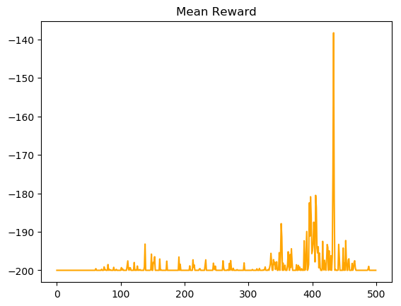
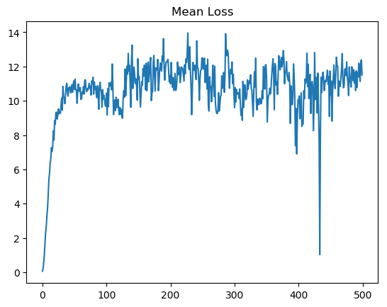
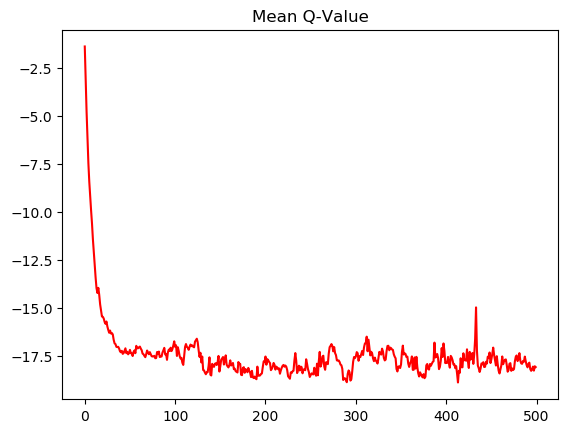
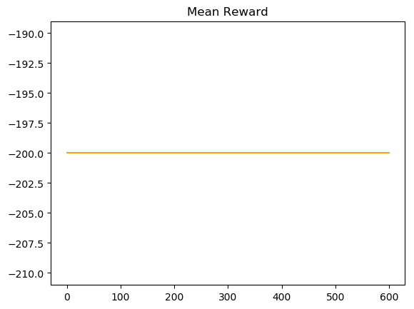
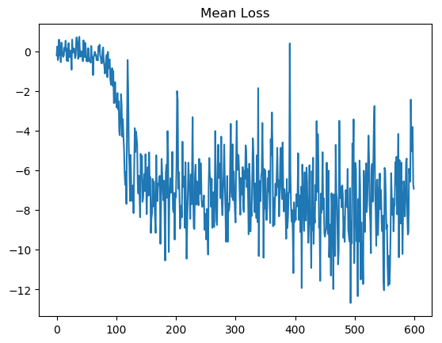

# MountainCar - Reinforcement Learning
Aims to solve MountainCar with QLearning and Policy Gradients.
The main goal of this project is to study Continuous Action Spaces.

## MountainCar
- [X] [ Q Learning ](#qlearning)
- [X] [ Policy Gradients ](#policygradients)

## MountainCarContinuous
- [ ] [ Q Learning ](#qlearningcont)
- [ ] [ Policy Gradients ](#policygradientscont)

# Results 
This is actually harder than it seems since the reward is very sparse and epsilon-greedy or sampling from an action-distribution is hardly ever going to guide us to the top of the hill. Our agent only gets a reward of -1 until he eventually reaches a position of 0.5, which means that on-policy methods will have a hard time converging because, unlike Q-Learning, the reward is not backpropagated due to the lack of bootstrapping, hence it will need to reach the hill in each episode to make any improvements(Monte Carlo). QLearning also has a hard time without Memory since it is unlikely to get on or close to the hill multiple times. Thus, the bootstrapping will be essentially useless.

#### Solutions: Actor Critic with Memory(DDPG).

The only 
X-Axis = Epochs/100

## Q-Learning
Should be able to solve this problem given enough time.
Used memory and fixed targets improvement.
Additional improvements: Prioritized Memory

  
   
  

## PolicyGradient
Unable to solve it at all. Needs a kind of directed exploration like Curiosity.
Improvements: Actor Critic -> DDPG
(I tried epsilon greedy on PG but it never reached the hill)

  
   

## Q-Learning
In this case you can view the action space as 2 actions or 1.

2 actions: You predict whether to push left or right using standard Q-Values, then use a second network(State,Action = Input) to predict how much to accelerate. Limit these predictions to the supported environment range.
Idea: Use two heads of the same network one for the action distributions and one for the action-value.

1 action: Same as above but there is only one action to choose from, which makes the Q-Values prediction redundant so we can try to directly predict the action-value.

Problem: How do you find the correct action-values?

  
   
  

## PolicyGradient
Could theoretically be solved by predicting a broader action space(instead of Softmax we predict absolute values).

Problem: Need to implement a better exploration mechanism and test whether this works. Let's try out a simpler environment first: Pendulum

  
   

